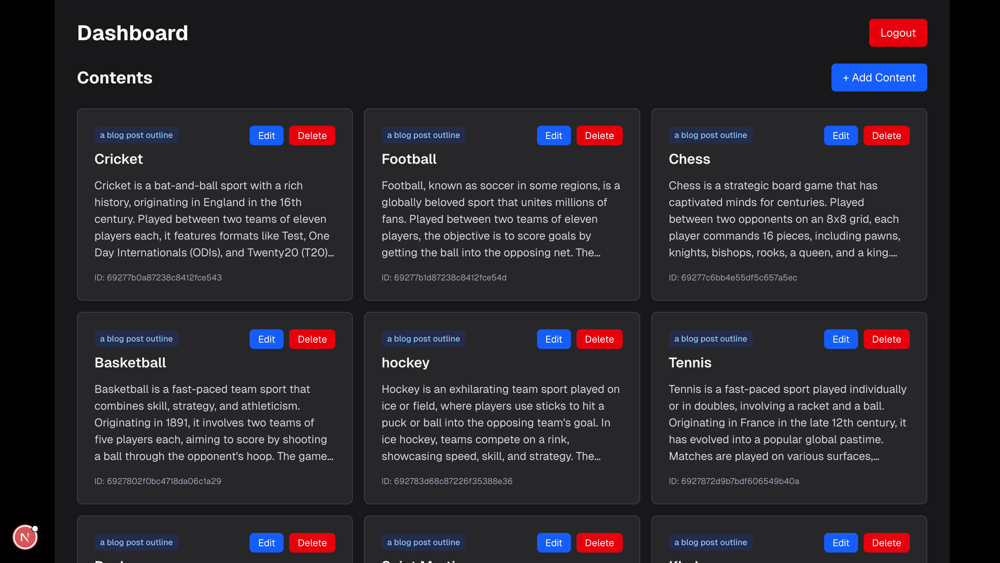

# AI-Powered Content Generator & Management System

A full-stack application for generating AI-powered content with real-time updates via WebSockets. Built with Next.js, Express, MongoDB, Redis, and OpenAI API.

## Features

- ✅ User authentication (signup/login)
- ✅ Content CRUD operations
- ✅ AI-powered content generation using OpenAI
- ✅ Queue-based job processing with Bull
- ✅ Real-time updates via WebSocket (Socket.io)
- ✅ State management with Zustand
- ✅ Dockerized deployment

## Tech Stack

### Backend
- **Node.js** with Express.js
- **MongoDB** for data storage
- **Redis** for job queue
- **Socket.io** for real-time communication
- **Bull** for job queue management
- **JWT** for authentication

### Frontend
- **Next.js 16** (React 19)
- **TypeScript**
- **Tailwind CSS**
- **Zustand** for state management
- **Socket.io Client** for real-time updates

### Worker
- Background job processing
- OpenAI API integration

## Prerequisites

- **Docker** and **Docker Compose** (for Docker setup)
- **Node.js 22+** (for local development)
- **MongoDB** (or use Docker)
- **Redis** (or use Docker)
- **OpenAI API Key** (for AI content generation)

## Environment Variables

Create  `.env` from `.env.example` using `cp .env.example .env` and then update the values

## Running the Project

### Option 1: Docker (Recommended)

The easiest way to run the entire project is using Docker Compose:

1. **Create `.env` file** in the root directory with the required variables (see above)

2. **Build and start all services:**
   ```bash
   docker-compose up --build
   ```

3. **Access the application:**
   - Frontend: http://localhost:3000
   - Backend API: http://localhost:4000
   - MongoDB: localhost:27017
   - Redis: localhost:6379

4. **Stop all services:**
   ```bash
   docker-compose down
   ```

5. **Stop and remove volumes (clean slate):**
   ```bash
   docker-compose down -v
   ```

### Option 2: Local Development

For local development without Docker:

#### 1. Start MongoDB and Redis

**Using Docker (easiest):**
```bash
docker-compose up mongo redis
```

**Or install locally:**
- Install MongoDB and start the service
- Install Redis and start the service

#### 2. Setup Backend

```bash
cd backend
npm install
npm run dev
```

Backend will run on http://localhost:4000

#### 3. Setup Worker (in a new terminal)

```bash
cd worker
npm install
npm start
```

#### 4. Setup Frontend (in a new terminal)

```bash
cd frontend
npm install
npm run dev
```

Frontend will run on http://localhost:3000

**Note:** Make sure to set `NEXT_PUBLIC_API_URL=http://localhost:4000/api` and `NEXT_WS_URL=http://localhost:4000` in your frontend environment or `.env.local` file.

## Project Structure

```
ai-content-app/
├── backend/              # Express.js API server
│   ├── src/
│   │   ├── app.js       # Express app setup
│   │   ├── server.js    # Server entry point with Socket.io
│   │   ├── routes/      # API routes
│   │   ├── models/      # MongoDB models
│   │   ├── middleware/  # Auth middleware
│   │   ├── socket/      # Socket.io modules
│   │   └── queue/       # Bull queue setup
│   └── Dockerfile
├── frontend/             # Next.js frontend
│   ├── src/
│   │   └── app/         # Next.js app directory
│   └── Dockerfile
├── worker/              # Background job processor
│   ├── services/        # AI service
│   └── Dockerfile
├── docker-compose.yml   # Docker orchestration
└── README.md
```

## API Endpoints

### Authentication
- `POST /api/auth/signup` - User registration
- `POST /api/auth/login` - User login

### Content
- `GET /api/content` - Get all user's content
- `POST /api/generate-content` - Generate new content (queues job)
- `GET /api/content/:jobId/status` - Get job status
- `PUT /api/content/:id` - Update content
- `DELETE /api/content/:id` - Delete content

### WebSocket
- Connects to base server URL (e.g., `http://localhost:4000`)
- Events:
  - `authenticated` - Sent when socket is authenticated
  - `auth_error` - Sent when authentication fails
  - `jobUpdate` - Real-time content updates

## Usage

1. **Sign up** for a new account or **login** with existing credentials
2. **Create content** by providing a prompt and content type
3. The system will queue the job and process it in the background
4. You'll receive **real-time updates** via WebSocket when content is generated
5. **Edit or delete** your content as needed

## Development

### Backend Development
```bash
cd backend
npm run dev  # Uses nodemon for auto-reload
```

### Frontend Development
```bash
cd frontend
npm run dev  # Next.js dev server with hot reload
```

### Worker Development
```bash
cd worker
npm start
```

## Production Build

### Backend
```bash
cd backend
npm install
npm start
```

### Frontend
```bash
cd frontend
npm install
npm run build
npm start
```

## Troubleshooting

### WebSocket Connection Issues
- Ensure `NEXT_WS_URL` is set correctly (should be `http://localhost:4000` for local dev)
- Check that the backend server is running
- Verify CORS settings if accessing from different origins

### MongoDB Connection Issues
- Ensure MongoDB is running
- Check `MONGO_URI` environment variable
- For Docker, ensure the mongo service is up

### Redis Connection Issues
- Ensure Redis is running
- Check `REDIS_URL` environment variable
- For Docker, ensure the redis service is up

### OpenAI API Issues
- Verify `OPENAI_API_KEY` is set correctly
- Check your OpenAI account has sufficient credits
- Ensure the API key has proper permissions


